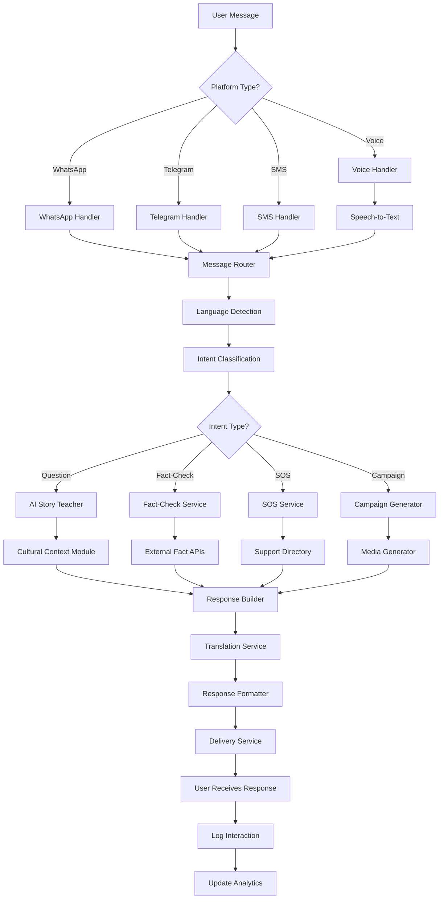

```mermaid
flowchart TD
    A[User Message] --> B{Platform Type?}
    
    B -->|WhatsApp| C[WhatsApp Handler]
    B -->|Telegram| D[Telegram Handler]  
    B -->|SMS| E[SMS Handler]
    B -->|Voice| F[Voice Handler]
    
    C --> G[Message Router]
    D --> G
    E --> G
    F --> H[Speech-to-Text]
    H --> G
    
    G --> I[Language Detection]
    I --> J[Intent Classification]
    
    J --> K{Intent Type?}
    
    K -->|Question| L[AI Story Teacher]
    K -->|Fact-Check| M[Fact-Check Service]
    K -->|SOS| N[SOS Service]
    K -->|Campaign| O[Campaign Generator]
    
    L --> P[Cultural Context Module]
    P --> Q[Response Builder]
    
    M --> R[External Fact APIs]
    R --> Q
    
    N --> S[Support Directory]
    S --> Q
    
    O --> T[Media Generator]
    T --> Q
    
    Q --> U[Translation Service]
    U --> V[Response Formatter]
    V --> W[Delivery Service]
    W --> X[User Receives Response]
    
    X --> Y[Log Interaction]
    Y --> Z[Update Analytics]
```